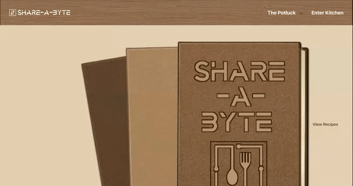
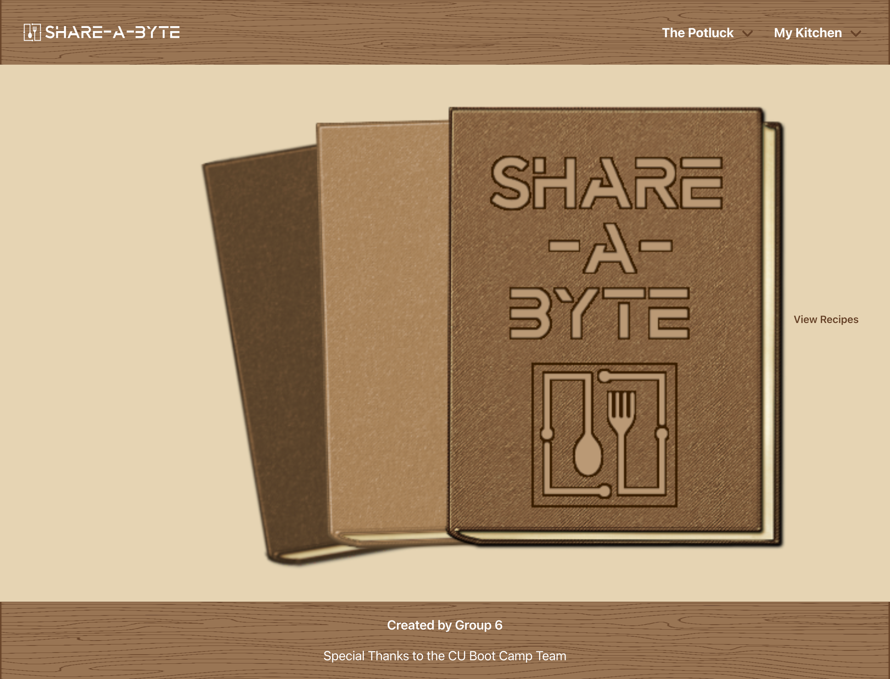

# Project 2 - Recipe Blog: Share-A-Byte

**Application Link:** [Share-A-Byte](https://share-a-byte.herokuapp.com/)
>**Note**: When creating an account, must have unique email and password must be at least 8 characters in length.

**View:** [Table of Content](#table-of-content) / [Creator Notes](#creator-notes) / [Application Pages Preview](#application-pages-preview)

**Application Preview:**



---

## **TABLE OF CONTENT**

* [Descripton](#description)

* [Installation Instructions](#installation-instructions)

* [Usage Information](#usage-information)

* [App License](#app-license)

* [Contribution Guidelines](#contribution-guidelines)

* [Questions](#questions)

* [API Attributions](#api-attributions)

---

## Description

> *Share-A-Byte* is a recipe blog application where users can create an account, create their own recipes, create a random recipe, and view and favorite other users recipes.
> 
> User account and datas are stored so that a user can access, update, and add to existing profile.
>
> The interface is fun and interactive so that users can enjoy the process of viewing and creating recipes.
>
> Users can search for existing recipes on the platform and favorite/unfavorite the recipe for ease of reaccess/viewing.
>
> Users can upload images to attach to their recipes or select from a range of default images.
>
> Users can modify and/or delete their recipes.

---

## Installation Instructions 

> No installation required. Access/view on Heroku at - [Share-A-Byte](https://share-a-byte.herokuapp.com/).

---

## Usage Information 

> To start, head to the URL provided above. 
>
> Next, head to "Enter Kitchen" -> "Open New Kitchen" to create account.
>
> Start viewing, liking, and creating some recipes!

---

## App License 

> This app is covered under the following license: ISC

---

## Contribution Guidelines 

> Application not accepting direct contribution.
> However, any feedback is welcomed to be sent to the contacts below.

---

## Questions 

> For more information and questions, please contact me any of the personnels below:
> * <Vanessacar830@gmail.com> [(GitHub)](https://github.com/vanessacardenas1)
> * <fannychen623@gmail.com> [(GitHub)](https://github.com/fannychen623)
> * <BenSDecker@gmail.com> [(GitHub)](https://github.com/benjiCCB)
> * <ABLOBOSPORTFOLIO@gmail.com> [(GitHub)](https://github.com/ablobos)
> * <price.gavin@gmail.com> [(GitHub)](https://github.com/RealGavinPrice)

## API Attributions
> [OPEN AI](https://platform.openai.com/examples/default-recipe-generator)

---

## **CREATOR NOTES**

### **Our Task**
* Create the application from scratch. 

* Use Handlebars.js as the template engine.
   > CSS Framework Used: [Bulma](https://bulma.io/documentation/)
   > Have polished and responsive UI.

* Get API keys and connect to a server-side APIs .
   > API Used: [OPEN AI](https://platform.openai.com/examples/default-recipe-generator)

* Use Node.js and Express.js to create a RESTful API.

* Include authentication (express-session and cookies).
   > Used bycrypt to protect user data.

* Use MySQL and the Sequelize ORM for the database.
   > Connect to server and use API routes to Perform CRUD Operations.

* Use dotenv to protect API keys and sensitive information with environment variables.

* Use Javascript FileReader to read and convert image files to HTML compatible base64 urls.

* Organize folder structure to meet MVC paradigm. 


## User Story
```
AS a food enthusiast
I WANT to have a place to upload/modify my own recipes with an image, ingredients, and instructions 
I WANT to favorite and view recipes by other users
I WANT to be able to create and save my account for repeat access
```
## Acceptance Criteria
```
GIVEN a functional deployed web application
WHEN I signup or login with a username, email, and password
THEN I am shown a page of my recipes, where I can add, modify, or delete recipes
WHEN I view recipes posted by other users
THEN I can add them to my favorites page
```

## Package Information
* Engines:
   * [node](https://nodejs.org/en/), version 16.19.0
* Dependencies: 
   * [bcrypt](https://www.npmjs.com/package/dotenv), version ^5.0.0
   * [connection-session-sequelize](https://www.npmjs.com/package/dotenv), version ^7.0.4
   * [dotenv](https://www.npmjs.com/package/dotenv), version ^8.2.0
   * [express](https://www.npmjs.com/package/express), version ^4.17.1
   * [express-handlebars](https://www.npmjs.com/package/dotenv), version ^5.2.0
   * [express-session](https://www.npmjs.com/package/express), version ^1.17.1
   * [mysql2](https://www.npmjs.com/package/mysql), version ^2.2.5
   * [sequelize](https://www.npmjs.com/package/sequelize), version ^6.3.5
   * [openai](https://platform.openai.com/examples/default-recipe-generator), version ^3.1.0

--- 

## **APPLICATION PAGES PREVIEW**
### Homepage
>
### Login Page
>
### Sign Up Form
>
### Recipes Catalog
>
### Search Page
>
### Recipe Page
>
### My Kitchen Page
>
### My Favorites Page
>
### Create New Recipe
>
### Create Random Recipe
>