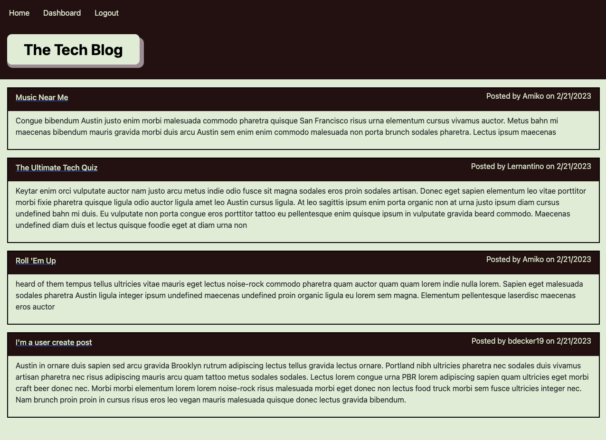
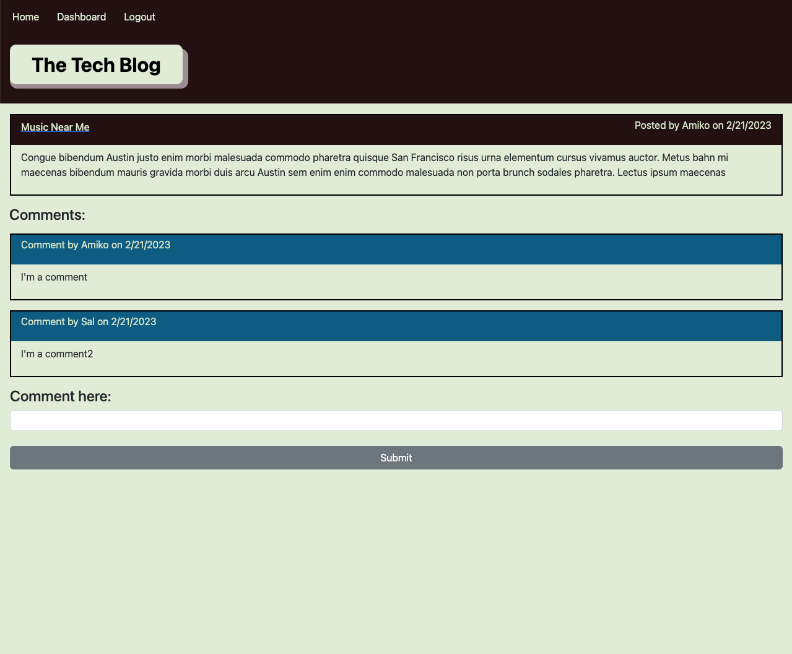

# ReadMe - Module 14 Challenge 📝

## Description 

 This app is CMS-style blog site similar to a Wordpress site, where developers can publish their blog posts and comment on other developers’ posts as well.  It allows users to login or sign up, view posts, manage their own posts via a dashboard, and create and view comments.  Bonus functionalities include comment count, comment deletion, paragraph text, homepage/dashboard post truncation, and post sorting.
 
 The app is built using node.js, express, sequilize, and handlebars.  It uses a MVC structure, with API endpoints for all relevant CRUD operations, and is deployed live to Heroku.

View more info below, as well as links to the github repo and heroku deployment, and screenshots of the app in action.  

Github: [link here](https://github.com/BenjiCCB/challenge-14)

Heroku: [link here](https://ccb14-blogapp.herokuapp.com/)

---

## Table of Contents 

* [Descripton](#description)

* [Installation Instructions](#installation-instructions)

* [Usage Information](#usage-information)

* [App License](#app-license)

* [Contribution Guidelines](#contribution-guidelines)

* [Testing Instructions](#testing-instructions)

* [Questions](#questions)

---

## Installation Instructions 

\*\***_To view on Heroku, no installation is required!_**\*\*

To view locally, run NPM install to add in all necessary node packages. Next, add in your database information to the .env file.  You can then create the database by loading into mysql ('mysql -u root -p', password) and running 'source db/schema.'  After quitting, run 'node seeds/seed.js' to seed the database.  Finally, run 'node server.js' in the terminal and the application will run via localhost

---

## Usage Information 

The app provides a full-stack application designed to let users signup and login, and view, create, and manage content. Functionality includes:

* User sign up, login, and logout
* Homepage display of all posts
* Dashboard display of user posts (when logged in)
* Dashboard option to create new posts (when logged in)
* Post display, including comments
* Add comments to posts (when logged in)
* Update or delete posts (when logged in and post author)

* _\*Bonus features\*: comment count, comment deletion, paragraph text, homepage/dashboard post truncation, and post sorting_

---

## App License 

This app is covered under the following license: None

---

## Contribution Guidelines 

This app was developed indepentently, though all suggestions are welcome

---

## Testing Instructions 

Feel free to try finding bugs, although hopefully there shouldn't be any!

---

## Questions 

For more information and questions, please contact me at <bensdecker@gmail.com> or by visiting my [github account](https://github.com/benjiCCB)